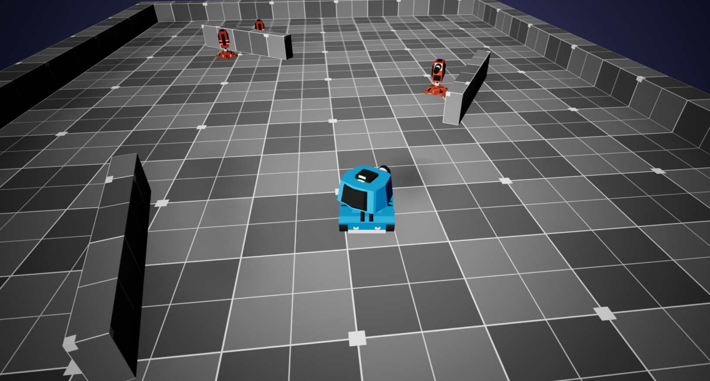
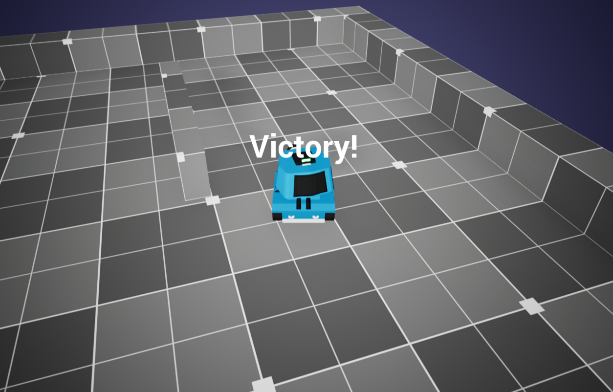
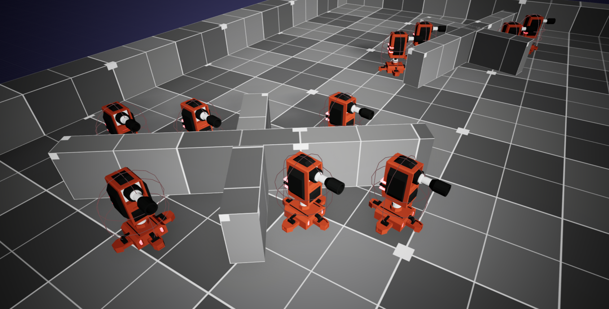
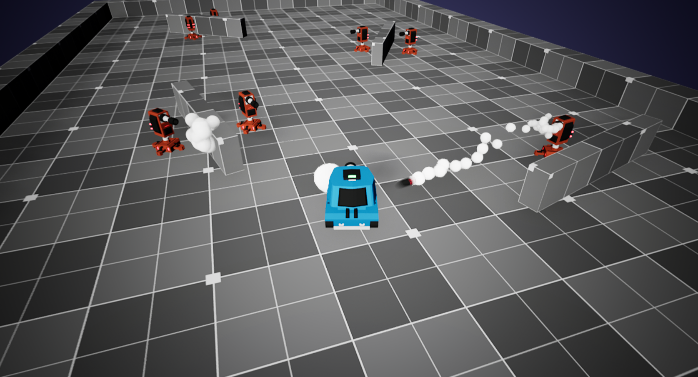

# 🪖 Battle Blaster — UE5 Tank Shooter

A 3D tank combat game built with **Unreal Engine 5** and **C++**, featuring real-time movement, projectile-based combat, AI-controlled enemies, and full game state management.


---

## 🎮 Overview

Control a tank in an arena filled with AI-controlled enemy towers and fight to survive.

- Destroy all enemy towers before they eliminate you
- Dodge incoming projectiles using movement and positioning
- Aim precisely and manage combat strategically

The project focuses on clean architecture, modular components, and reusable systems — demonstrating how core gameplay mechanics combine into a complete playable experience.

---

## ⚙️ Features

- 🚗 Player-controlled tank movement
- 🎯 Turret rotation and aiming system
- 💣 Projectile-based combat
- ❤️ Health and damage system
- 🤖 AI-controlled enemy towers
- 🧠 Game mode with win/lose conditions
- 📢 On-screen debug messaging

---

## 🏗️ Project Structure

```
Source/
│
├── BasePawn
├── Tank
├── Tower
├── Projectile
├── HealthComponent
├── BattleBlasterGameMode
├── BattleBlasterGameInstance
├── ScreenMessage
└── BattleBlaster
```

---

## 🧩 System Overview

### BasePawn
Shared functionality for mesh setup, turret rotation, and firing logic. Acts as the foundation for both player and enemy entities.

### Tank
Player-controlled pawn responsible for movement, input handling, and camera control.

### Tower
Enemy AI unit that continuously tracks the player, rotates its turret, and fires projectiles automatically.

### Projectile
Handles movement, collision detection, and damage application on impact.

### HealthComponent
A reusable component managing damage intake, health tracking, and destruction behavior.

### GameMode
Controls overall game flow — initialization, win conditions, and loss conditions.

---

## 📸 Screenshots

### 🎮 Gameplay Overview


### 💥 Combat System


### 🤖 Enemy Towers


### 🏆 Victory State


---

## 🎮 Controls

| Action        | Key        |
|---------------|------------|
| Move Forward  | W          |
| Move Backward | S          |
| Turn Left     | A          |
| Turn Right    | D          |
| Aim           | Mouse      |
| Fire          | Left Click |

---

## ⚙️ Setup Instructions

1. **Clone the repository**
   ```bash
   git clone https://github.com/Shaurya1907/UE_5TankShooter.git
   ```
2. **Open the project**
   Open the `BattleBlaster.uproject` file in Unreal Engine 5.
3. **Build**
   Compile the project inside the editor.
4. **Run**
   Press **Play** to start the game.

---

## 🧠 Notes

This project was developed to strengthen understanding of:

- Object-oriented programming in C++
- Unreal Engine gameplay architecture (Actors, Pawns, Components)
- AI behavior and interaction systems
- Collision detection and physics handling
- Game loop design and state management

---

## 📄 License

This project is licensed under the MIT License. See [License.txt](License.txt) for details.